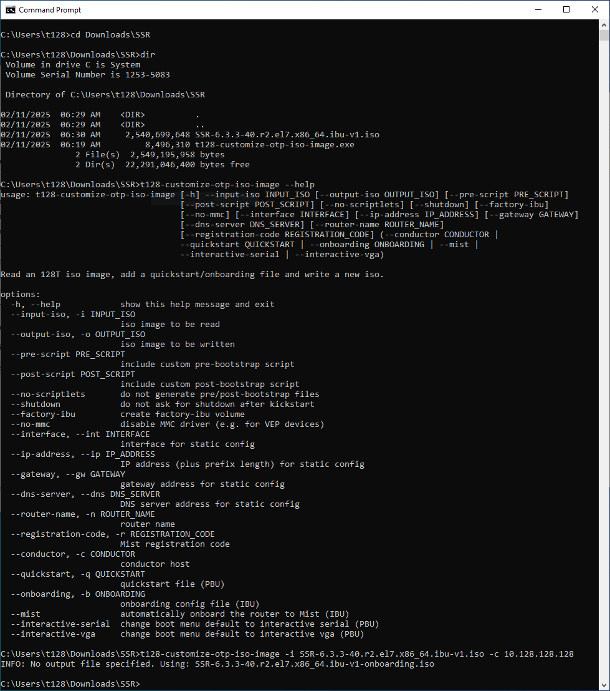

# t128-customize-otp-iso-image
This tool helps to ease the deployment of 128T/SSR routers using ISO images, especially together with bootable USB drives.

Typically, when an unmodified ISO image `128T-<version>OTP.v1.x86_64.iso` is used, there has to be another USB drive inserted after the initial installation to SSD and prior to first boot. To be detected by the bootstrap process this USB drive must have the label `BOOTSTRAP` and must contain a file called `bootstrap.quickstart`

Details are documented at: [https://docs.128technology.com/docs/intro\_otp\_iso\_install](https://docs.128technology.com/docs/intro_otp_iso_install)

In order to be able to have one USB drive for the whole procedure `t128-customize-otp-iso-image` runs these steps:

1. read an unmodified 128T ISO image as source for a customized ISO (output file)
2. generate a generic quickstart file including the IP address(es) of the 128T/SSR conductor node(s)
3. add this quickstart file together with helper scripts to the new ISO into the `bootstrap` directory
4. also add a file `conductors.txt` which contains the same IP address(es)
5. extend the kickstart configuration on the ISO image to copy the quickstart file and scripts onto the target system (SSD)
6. finalize (write) the customized ISO image

## Custom quickstart files

In some situations it may be desirable to use a custom quickstart file, e.g. a router-specific file or a file with additional generic 128T/SSR configuration items.

The `--quickstart` command line parameter allows to provide such a file, which overrides the auto-generated generic quickstart file.

## Supported operating systems

Inside the `binaries` directory there are standalone executables for the following operating systems:

* Windows (exe file)
* macOS (older versions - before macOS 12 - that are not shipped with Python 3)
* Linux (and newer macOS systems) with installed Python 3 (.pyz file)

The minimal syntax is:

```
t128-customize-otp-iso-image -i 128T-<version>OTP.v1.x86_64.iso -c 10.128.128.128
```

In this example `10.128.128.128` represents the IP address of the conductor and the ISO image is the unmodified file as downloaded from SSR software repositories.

An output filename can be given using the `-o` switch. If omitted, the output filename is generated based on the input filename suffixed by `-quickstart`

### Running on Windows

It is recommended to create a new folder e.g. `Downloads\128T` and copy/move the .exe file as well as the downloaded ISO image into it.

Afterwards open a shell (*Command Prompt*, cmd.exe), change into this folder and run `t128-customize-otp-iso-image` as described above. The customized ISO image will be placed at the same location.



### Running on macOS

Similar to windows, just copy the macOS binary together with the ISO image into a subfolder `128T` at `Downloads` and run:

```
cd ~/Downloads/128T
chmod +x t128-customize-otp-iso-image
./t128-customize-otp-iso-image -i 128T-<version>OTP.v1.x86_64.iso -c 10.128.128.128
```

Note: the binary needs to be executable. There might be a security warning by macOS referring to this downloaded binary. If this is the case give permission at System Preferences > Security.


### Running on Linux

On modern Linux installations there should be python3 pre-installed, so the .pyz file can be used:

```
cd ~/Downloads/128T
chmod +x t128-customize-otp-iso-image.pyz
./t128-customize-otp-iso-image.pyz -i 128T-<version>OTP.v1.x86_64.iso -c 10.128.128.128,
```

## Scriptlets

As part of the bootstrap process it is possible to incorporate a script `pre-bootstap`and/or `post-bootstrap`
By default a post-bootstrap script is added, which enables all ethernet interfaces on the target router to allow zero-touch provisioning (ZTP).

The `--no-scriptlets` command line parameter allows to disable auto-generated `pre-bootstap`and `post-bootstrap` scripts. This might make sense if a custom quickstart file is provided and conductor connection should be established via 128T/SSR rather than Linux interfaces.

